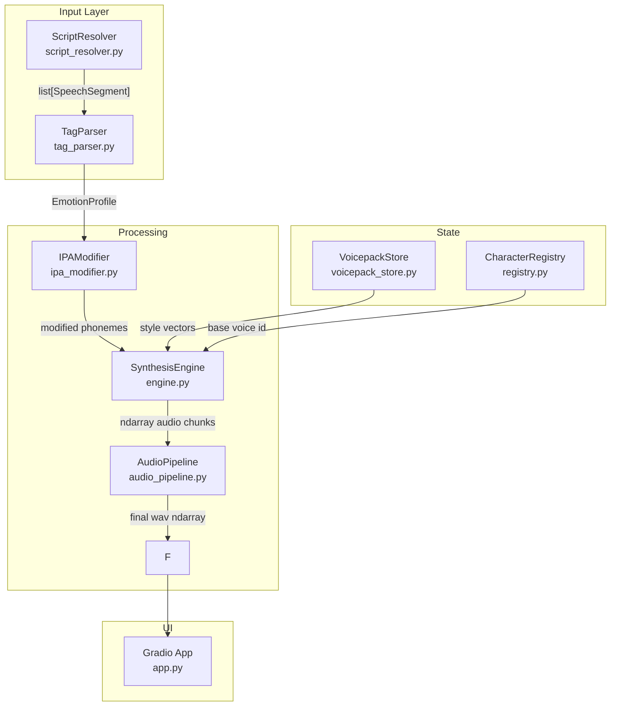

# Kokoro Expressive Audiobook TTS — Phase 1 Implementation Plan

> **For agentic workers:** REQUIRED SUB-SKILL: Use `superpowers:subagent-driven-development` to implement this plan task-by-task. Steps use checkbox (`- [ ]`) syntax for tracking.

**Goal:** Build a fully working Gradio audiobook TTS app that parses ElevenLabs-style expression tags (`[happy]`, `[whisper]`, screenplay format, EPUB import) and synthesizes expressive audio using the base Kokoro-82M ONNX model on CPU — no GPU required.

**Architecture:** The app is a pipeline of focused modules. Text enters through a `ScriptResolver` that detects format (inline tags / screenplay / EPUB) and emits `SpeechSegment` objects. Each segment carries its `EmotionProfile` (speed, IPA prefix, volume, pause, SFX). The `SynthesisEngine` wraps `kokoro-onnx`, selects the right style vector per segment, and calls the ONNX model. The `AudioPipeline` concatenates chunks, injects silence/SFX, and crossfades boundaries. Gradio surfaces the whole pipeline with a 3-tab UI.

**Architecture Diagram:**



**Tech Stack:** Python 3.14, `kokoro-onnx==0.4.7`, `gradio==6.29.1`, `soundfile`, `numpy==2.5.3`, `ebooklib` (EPUB parsing), `pydub` (MP3 export), `pytest` (testing)

**Spec:** [`2026-10-06-kokoro-expressive-audiobook-tts-design.md`](file:///c:/Users/patri/OneDrive/Desktop/Holy%20folder/kokoro-tts/docs/superpowers/specs/2026-10-06-kokoro-expressive-audiobook-tts-design.md)

## Global Constraints

- Python 3.14, venv at `venv/` — always run via `.\venv\Scripts\python.exe` and `.\venv\Scripts\pytest.exe`
- All audio: 24,000 Hz mono float32 numpy arrays (Kokoro's native format)
- All file paths use forward slashes in code; backslashes only in shell commands
- `PYTHONIOENCODING=utf-8` must be set before any process that prints IPA characters
- No GPU usage in Phase 1 — CPU inference only via `onnxruntime` CPUExecutionProvider
- Model files live in `models/` directory; SFX clips live in `sfx/`
- Tests live in `tests/` mirroring `app/` structure (e.g., `tests/parser/test_tag_parser.py`)
- Gradio version: 6.29.1 — use `gr.Blocks` API (not deprecated `gr.Interface` for multi-tab)

---

## Task 0: Project Scaffold & Model Download

**Files:**
- Create: `app/__init__.py`
- Create: `app/parser/__init__.py`
- Create: `app/synthesis/__init__.py`
- Create: `app/characters/__init__.py`
- Create: `tests/__init__.py`
- Create: `tests/parser/__init__.py`
- Create: `tests/synthesis/__init__.py`
- Create: `requirements.txt`
- Create: `download_models.py`

**Interfaces:**
- Produces: `models/kokoro-v1.0.onnx`, `models/voices-v1.0.bin` (required by Task 5+)

- [ ] **Step 1: Install missing dependencies**

```powershell
.\venv\Scripts\pip.exe install ebooklib pydub pytest pytest-mock
```

Expected output: Successfully installed packages (ebooklib, pydub, pytest, pytest-mock)

- [ ] **Step 2: Create directory structure**

```powershell
New-Item -ItemType Directory -Force -Path app/parser, app/synthesis, app/characters, tests/parser, tests/synthesis, models, sfx, emotions
New-Item -ItemType File -Force -Path app/__init__.py, app/parser/__init__.py, app/synthesis/__init__.py, app/characters/__init__.py, tests/__init__.py, tests/parser/__init__.py, tests/synthesis/__init__.py
```

- [ ] **Step 3: Write `requirements.txt`**

```
kokoro-onnx==0.4.7
gradio==6.29.1
soundfile
numpy
ebooklib
pydub
pytest
pytest-mock
```

- [ ] **Step 4: Write `download_models.py`**

```python
"""Download Kokoro model weights to models/ directory."""
import urllib.request
import os

MODELS_DIR = "models"
BASE_URL = "https://github.com/thewh1teagle/kokoro-onnx/releases/download/model-files-v1.1"

FILES = [
    ("kokoro-v1.0.onnx", "~320MB - full precision model"),
    ("voices-v1.0.bin",  "~27MB  - voice style vectors"),
]

def download(filename: str, description: str) -> None:
    dest = os.path.join(MODELS_DIR, filename)
    if os.path.exists(dest):
        print(f"  ✓ {filename} already present")
        return
    url = f"{BASE_URL}/{filename}"
    print(f"  ↓ Downloading {filename} ({description})...")
    urllib.request.urlretrieve(url, dest)
    print(f"  ✓ {filename} saved to {dest}")

if __name__ == "__main__":
    os.makedirs(MODELS_DIR, exist_ok=True)
    for name, desc in FILES:
        download(name, desc)
    print("\nDone. Model files ready in models/")
```

- [ ] **Step 5: Run the downloader**

```powershell
$env:PYTHONIOENCODING="utf-8"; .\venv\Scripts\python.exe download_models.py
```

Expected: Both files downloaded to `models/`. Takes ~2-5 minutes depending on connection.

- [ ] **Step 6: Verify model loads**

```powershell
$env:PYTHONIOENCODING="utf-8"; .\venv\Scripts\python.exe -c "from kokoro_onnx import Kokoro; k = Kokoro('models/kokoro-v1.0.onnx', 'models/voices-v1.0.bin'); print('Voices:', k.get_voices()[:3])"
```

Expected: Prints first 3 voice names (e.g. `['af_alloy', 'af_aoede', 'af_bella']`)

- [ ] **Step 7: Commit scaffold**

```powershell
git init
git add .
git commit -m "chore: project scaffold, model downloader, requirements"
```

---

## Task 1: Emotion Profiles Table

**Files:**
- Create: [`app/parser/emotion_profiles.py`](file:///c:/Users/patri/OneDrive/Desktop/Holy%20folder/kokoro-tts/app/parser/emotion_profiles.py)
- Create: [`tests/parser/test_emotion_profiles.py`](file:///c:/Users/patri/OneDrive/Desktop/Holy%20folder/kokoro-tts/tests/parser/test_emotion_profiles.py)

**Interfaces:**
- Produces: `EmotionProfile` dataclass, `EMOTION_PROFILES: dict[str, EmotionProfile]`, `EMOTION_TOKENS: dict[str, int]`, `resolve_profile(tag: str) -> EmotionProfile`
- Consumed by: Task 2 (TagParser), Task 4 (SynthesisEngine)

- [ ] **Step 1: Write failing tests**

```python
# tests/parser/test_emotion_profiles.py
import pytest
from app.parser.emotion_profiles import (
    EmotionProfile, EMOTION_PROFILES, EMOTION_TOKENS, resolve_profile
)

def test_emotion_profiles_has_required_tags():
    required = [
        "neutral", "happy", "sad", "angry", "fearful", "excited", "calm",
        "nervous", "whisper", "shout", "laugh", "cry", "sigh", "gasp",
        "dramatic", "sarcastic", "monotone", "hesitant", "confident",
        "pause", "long pause",
    ]
    for tag in required:
        assert tag in EMOTION_PROFILES, f"Missing tag: {tag}"

def test_emotion_profile_fields():
    p = EMOTION_PROFILES["happy"]
    assert isinstance(p.speed, float)
    assert isinstance(p.ipa_prefix, (str, type(None)))
    assert isinstance(p.volume_db, float)
    assert isinstance(p.pause_before_ms, int)
    assert isinstance(p.pause_after_ms, int)
    assert isinstance(p.sfx_file, (str, type(None)))
    assert isinstance(p.silence_ms, (int, type(None)))
    assert isinstance(p.emotion_token, int)

def test_emotion_tokens_unique():
    tokens = list(EMOTION_TOKENS.values())
    assert len(tokens) == len(set(tokens)), "Emotion token IDs must be unique"

def test_emotion_tokens_start_at_178():
    assert min(EMOTION_TOKENS.values()) == 178

def test_resolve_profile_exact_match():
    p = resolve_profile("happy")
    assert p.emotion_token == EMOTION_TOKENS["happy"]

def test_resolve_profile_case_insensitive():
    assert resolve_profile("HAPPY").emotion_token == resolve_profile("happy").emotion_token

def test_resolve_profile_alias_whisper():
    # "whispering" should resolve to "whisper"
    assert resolve_profile("whispering").emotion_token == resolve_profile("whisper").emotion_token

def test_resolve_profile_unknown_returns_neutral():
    p = resolve_profile("nonexistenttag")
    assert p.emotion_token == EMOTION_TOKENS["neutral"]

def test_pause_profile_has_silence_ms():
    p = resolve_profile("pause")
    assert p.silence_ms == 500

def test_long_pause_profile_has_silence_ms():
    p = resolve_profile("long pause")
    assert p.silence_ms == 1200
```

- [ ] **Step 2: Run tests — expect FAIL**

```powershell
$env:PYTHONIOENCODING="utf-8"; .\venv\Scripts\pytest.exe tests/parser/test_emotion_profiles.py -v
```

Expected: `ModuleNotFoundError: No module named 'app'`

- [ ] **Step 3: Implement `emotion_profiles.py`**

```python
# app/parser/emotion_profiles.py
"""
Emotion tag definitions: maps tag names to synthesis parameter bundles.
EmotionProfile fields:
  speed         - speech rate multiplier (1.0 = normal)
  ipa_prefix    - IPA pitch direction marker prepended to phonemes (↗ ↘ → etc.) or None
  volume_db     - post-processing volume offset in dB (0.0 = no change)
  pause_before_ms - silence injected BEFORE the segment (milliseconds)
  pause_after_ms  - silence injected AFTER the segment (milliseconds)
  sfx_file      - path to SFX WAV to inject before this segment, or None
  silence_ms    - if set, this profile is ONLY silence (no TTS synthesis)
  emotion_token - integer ID injected as first token at training/inference time
"""
from dataclasses import dataclass, field
from typing import Optional


@dataclass(frozen=True)
class EmotionProfile:
    speed: float = 1.0
    ipa_prefix: Optional[str] = None
    volume_db: float = 0.0
    pause_before_ms: int = 0
    pause_after_ms: int = 50
    sfx_file: Optional[str] = None
    silence_ms: Optional[int] = None
    emotion_token: int = 178  # default: neutral


EMOTION_TOKENS: dict[str, int] = {
    "neutral":   178,
    "happy":     179,
    "sad":       180,
    "angry":     181,
    "fearful":   182,
    "excited":   183,
    "calm":      184,
    "nervous":   185,
    "whisper":   186,
    "shout":     187,
    "laugh":     188,
    "cry":       189,
    "sigh":      190,
    "gasp":      191,
    "dramatic":  192,
    "sarcastic": 193,
    "monotone":  194,
    "hesitant":  195,
    "confident": 196,
}

EMOTION_PROFILES: dict[str, EmotionProfile] = {
    "neutral":    EmotionProfile(speed=1.0,  ipa_prefix="→",  volume_db=0.0,  pause_before_ms=0,   pause_after_ms=50,  emotion_token=178),
    "happy":      EmotionProfile(speed=1.1,  ipa_prefix="↗",  volume_db=0.0,  pause_before_ms=0,   pause_after_ms=50,  emotion_token=179),
    "sad":        EmotionProfile(speed=0.85, ipa_prefix="↘",  volume_db=-2.0, pause_before_ms=100, pause_after_ms=150, emotion_token=180),
    "angry":      EmotionProfile(speed=1.15, ipa_prefix="↑",  volume_db=3.0,  pause_before_ms=0,   pause_after_ms=80,  emotion_token=181),
    "fearful":    EmotionProfile(speed=1.2,  ipa_prefix="↗",  volume_db=-1.0, pause_before_ms=50,  pause_after_ms=100, emotion_token=182),
    "excited":    EmotionProfile(speed=1.2,  ipa_prefix="↗",  volume_db=1.0,  pause_before_ms=0,   pause_after_ms=50,  emotion_token=183),
    "calm":       EmotionProfile(speed=0.9,  ipa_prefix="→",  volume_db=-1.0, pause_before_ms=50,  pause_after_ms=100, emotion_token=184),
    "nervous":    EmotionProfile(speed=1.1,  ipa_prefix="↗",  volume_db=0.0,  pause_before_ms=0,   pause_after_ms=50,  emotion_token=185),
    "whisper":    EmotionProfile(speed=0.9,  ipa_prefix=None, volume_db=-8.0, pause_before_ms=50,  pause_after_ms=50,  emotion_token=186),
    "shout":      EmotionProfile(speed=1.2,  ipa_prefix="↑",  volume_db=4.0,  pause_before_ms=0,   pause_after_ms=100, emotion_token=187),
    "laugh":      EmotionProfile(speed=1.15, ipa_prefix=None, volume_db=0.0,  pause_before_ms=50,  pause_after_ms=100, sfx_file="sfx/laugh.wav", emotion_token=188),
    "cry":        EmotionProfile(speed=0.8,  ipa_prefix="↘",  volume_db=-2.0, pause_before_ms=100, pause_after_ms=200, sfx_file="sfx/cry.wav",   emotion_token=189),
    "sigh":       EmotionProfile(speed=0.85, ipa_prefix="↘",  volume_db=-3.0, pause_before_ms=50,  pause_after_ms=150, sfx_file="sfx/sigh.wav",  emotion_token=190),
    "gasp":       EmotionProfile(speed=1.0,  ipa_prefix=None, volume_db=0.0,  pause_before_ms=0,   pause_after_ms=50,  sfx_file="sfx/gasp.wav",  emotion_token=191),
    "dramatic":   EmotionProfile(speed=0.8,  ipa_prefix="↘",  volume_db=0.0,  pause_before_ms=100, pause_after_ms=200, emotion_token=192),
    "sarcastic":  EmotionProfile(speed=0.95, ipa_prefix="↗",  volume_db=0.0,  pause_before_ms=0,   pause_after_ms=50,  emotion_token=193),
    "monotone":   EmotionProfile(speed=1.0,  ipa_prefix="→",  volume_db=-1.0, pause_before_ms=0,   pause_after_ms=30,  emotion_token=194),
    "hesitant":   EmotionProfile(speed=0.8,  ipa_prefix=None, volume_db=0.0,  pause_before_ms=50,  pause_after_ms=100, emotion_token=195),
    "confident":  EmotionProfile(speed=1.05, ipa_prefix="→",  volume_db=1.0,  pause_before_ms=0,   pause_after_ms=50,  emotion_token=196),
    # Pacing-only (no TTS synthesis, just silence injection)
    "pause":      EmotionProfile(silence_ms=500,  emotion_token=178),
    "long pause": EmotionProfile(silence_ms=1200, emotion_token=178),
    "short pause":EmotionProfile(silence_ms=250,  emotion_token=178),
}

# Aliases: normalize variant forms to canonical tag name
_ALIASES: dict[str, str] = {
    "whispering": "whisper",
    "shouting":   "shout",
    "shouted":    "shout",
    "crying":     "cry",
    "sobbing":    "cry",
    "laughing":   "laugh",
    "laughs":     "laugh",
    "chuckles":   "laugh",
    "giggles":    "laugh",
    "sighing":    "sigh",
    "sighs":      "sigh",
    "gasping":    "gasp",
    "gasps":      "gasp",
    "scared":     "fearful",
    "frightened": "fearful",
    "panicked":   "fearful",
    "energetic":  "excited",
    "cheerful":   "happy",
    "cheerfully": "happy",
    "sorrowful":  "sad",
    "melancholic":"sad",
    "furious":    "angry",
    "serene":     "calm",
    "quietly":    "calm",
    "slowly":     "dramatic",
    "deadpan":    "monotone",
    "flatly":     "monotone",
    "trembling":  "fearful",
    "shaky":      "nervous",
}


def resolve_profile(tag: str) -> EmotionProfile:
    """
    Return the EmotionProfile for a tag string.
    Handles case-insensitivity, alias resolution, and unknown tags (→ neutral).
    
    Args:
        tag: Raw tag string from parser (e.g. "HAPPY", "whispering", "long pause")
    
    Returns:
        The matching EmotionProfile, or the neutral profile if tag is unknown.
    """
    normalized = tag.strip().lower()
    canonical = _ALIASES.get(normalized, normalized)
    return EMOTION_PROFILES.get(canonical, EMOTION_PROFILES["neutral"])
```

- [ ] **Step 4: Run tests — expect PASS**

```powershell
$env:PYTHONIOENCODING="utf-8"; .\venv\Scripts\pytest.exe tests/parser/test_emotion_profiles.py -v
```

Expected: All 10 tests pass.

- [ ] **Step 5: Commit**

```powershell
git add app/parser/emotion_profiles.py tests/parser/test_emotion_profiles.py
git commit -m "feat: emotion profiles table with 30+ tags and alias resolution"
```

---

## Task 2: Tag Parser

**Files:**
- Create: [`app/parser/tag_parser.py`](file:///c:/Users/patri/OneDrive/Desktop/Holy%20folder/kokoro-tts/app/parser/tag_parser.py)
- Create: [`tests/parser/test_tag_parser.py`](file:///c:/Users/patri/OneDrive/Desktop/Holy%20folder/kokoro-tts/tests/parser/test_tag_parser.py)

**Interfaces:**
- Consumes: `EmotionProfile`, `resolve_profile()` from Task 1
- Produces: `SpeechSegment` dataclass, `TagParser.parse(raw_text: str, default_character: str = "NARRATOR") -> list[SpeechSegment]`
- Consumed by: Task 3 (ScriptResolver), Task 7 (Gradio UI)

- [ ] **Step 1: Write failing tests**

```python
# tests/parser/test_tag_parser.py
import pytest
from app.parser.tag_parser import TagParser, SpeechSegment
from app.parser.emotion_profiles import EMOTION_TOKENS

parser = TagParser()

def test_plain_text_no_tags():
    segments = parser.parse("Hello world.")
    assert len(segments) == 1
    assert segments[0].text == "Hello world."
    assert segments[0].emotion == "neutral"
    assert segments[0].character == "NARRATOR"

def test_inline_tag_before_text():
    segments = parser.parse("[happy] She smiled warmly.")
    assert len(segments) == 1
    assert segments[0].emotion == "happy"
    assert segments[0].text == "She smiled warmly."

def test_inline_tag_changes_between_sentences():
    text = "[happy] Good morning! [sad] But then she cried."
    segments = parser.parse(text)
    assert len(segments) == 2
    assert segments[0].emotion == "happy"
    assert segments[0].text == "Good morning!"
    assert segments[1].emotion == "sad"
    assert segments[1].text == "But then she cried."

def test_compound_tag_uses_first():
    segments = parser.parse("[whispering, nervous] Did you hear that?")
    assert segments[0].emotion == "whisper"  # "whispering" is alias for "whisper"

def test_pause_tag_produces_silence_segment():
    segments = parser.parse("Wait. [pause] Then she spoke.")
    pause_segs = [s for s in segments if s.is_silence]
    assert len(pause_segs) == 1
    assert pause_segs[0].profile.silence_ms == 500

def test_screenplay_format_character_and_emotion():
    text = "ALICE (angry): I can't believe this!"
    segments = parser.parse(text)
    assert len(segments) == 1
    assert segments[0].character == "ALICE"
    assert segments[0].emotion == "angry"
    assert segments[0].text == "I can't believe this!"

def test_screenplay_multi_emotion():
    text = "BOB (sad, quietly): I'm sorry."
    segments = parser.parse(text)
    assert segments[0].character == "BOB"
    assert segments[0].emotion == "sad"

def test_screenplay_narrator():
    text = "NARRATOR: The clock struck midnight."
    segments = parser.parse(text)
    assert segments[0].character == "NARRATOR"
    assert segments[0].emotion == "neutral"

def test_mixed_formats_in_one_block():
    text = "NARRATOR: It was quiet.\n[sad] She sighed.\nBOB (angry): Enough!"
    segments = parser.parse(text)
    assert len(segments) == 3
    assert segments[0].character == "NARRATOR"
    assert segments[1].emotion == "sad"
    assert segments[2].character == "BOB"

def test_empty_text_returns_empty():
    assert parser.parse("") == []
    assert parser.parse("   ") == []

def test_segment_has_profile():
    segments = parser.parse("[happy] Hello!")
    assert segments[0].profile.speed == 1.1
    assert segments[0].profile.emotion_token == EMOTION_TOKENS["happy"]
```

- [ ] **Step 2: Run tests — expect FAIL**

```powershell
$env:PYTHONIOENCODING="utf-8"; .\venv\Scripts\pytest.exe tests/parser/test_tag_parser.py -v
```

Expected: `ModuleNotFoundError: No module named 'app.parser.tag_parser'`

- [ ] **Step 3: Implement `tag_parser.py`**

```python
# app/parser/tag_parser.py
"""
Parses text containing expression tags into a list of SpeechSegments.

Supported formats:
  A) Inline tags:    [happy] She smiled. [sad] He wept.
  B) Screenplay:     ALICE (angry): I won't stand for this!
  C) Mixed:          any combination of A and B, line by line
"""
import re
from dataclasses import dataclass, field
from typing import Optional

from app.parser.emotion_profiles import EmotionProfile, resolve_profile

# Regex: [tag text] — captures everything inside brackets
_INLINE_TAG = re.compile(r'\[([^\]]+)\]')

# Regex: CHARACTER (emotion, optional emotion2): dialogue text
# Character must start with uppercase letter, rest uppercase/space
_SCREENPLAY = re.compile(
    r'^(?P<character>[A-Z][A-Z0-9 ]{0,30}?)\s*'
    r'(?:\((?P<emotions>[^)]+)\))?\s*:\s*(?P<text>.+)$'
)


@dataclass
class SpeechSegment:
    """One unit of speech: text to synthesize + how to synthesize it."""
    text: str
    emotion: str
    character: str
    profile: EmotionProfile
    is_silence: bool = False  # True for [pause] / [long pause] tags


class TagParser:
    """
    Parses raw text (any supported format) into a list of SpeechSegments.
    
    Line-by-line strategy:
    1. Try to match a screenplay line (CHAR (emotion): text)
    2. Otherwise scan for inline [tags] and split text at each tag boundary
    3. Track "current emotion" state across lines (last seen tag persists)
    """

    def parse(self, raw_text: str, default_character: str = "NARRATOR") -> list[SpeechSegment]:
        """
        Parse raw_text into speech segments.

        Args:
            raw_text: Input text with optional expression tags.
            default_character: Character name used when no screenplay header is present.

        Returns:
            List of SpeechSegment objects, in order.
        """
        if not raw_text or not raw_text.strip():
            return []

        segments: list[SpeechSegment] = []
        current_emotion = "neutral"
        current_character = default_character

        for line in raw_text.splitlines():
            line = line.strip()
            if not line:
                continue

            # Try screenplay format first
            m = _SCREENPLAY.match(line)
            if m:
                character = m.group("character").strip()
                raw_emotions = m.group("emotions") or "neutral"
                # Take first emotion from compound tags like "sad, quietly"
                emotion = raw_emotions.split(",")[0].strip()
                text = m.group("text").strip()
                profile = resolve_profile(emotion)
                segments.append(SpeechSegment(
                    text=text,
                    emotion=resolve_profile(emotion).emotion_token and emotion or "neutral",
                    character=character,
                    profile=profile,
                    is_silence=profile.silence_ms is not None,
                ))
                current_character = character
                current_emotion = emotion
                continue

            # Inline tag parsing: split line at [tag] boundaries
            line_segments = self._parse_inline(line, current_emotion, current_character)
            if line_segments:
                # Update state from last segment
                current_emotion = line_segments[-1].emotion
                current_character = line_segments[-1].character
                segments.extend(line_segments)

        return segments

    def _parse_inline(
        self,
        line: str,
        current_emotion: str,
        current_character: str,
    ) -> list[SpeechSegment]:
        """Split one line at inline [tag] boundaries."""
        segments: list[SpeechSegment] = []
        pos = 0
        active_emotion = current_emotion

        for match in _INLINE_TAG.finditer(line):
            # Text before this tag (use active_emotion)
            before = line[pos:match.start()].strip()
            if before:
                profile = resolve_profile(active_emotion)
                segments.append(SpeechSegment(
                    text=before,
                    emotion=active_emotion,
                    character=current_character,
                    profile=profile,
                    is_silence=profile.silence_ms is not None,
                ))

            # Update active emotion from this tag
            raw_tag = match.group(1)
            active_emotion = raw_tag.split(",")[0].strip()

            # Check if this tag is a silence-only tag
            profile = resolve_profile(active_emotion)
            if profile.silence_ms is not None:
                segments.append(SpeechSegment(
                    text="",
                    emotion=active_emotion,
                    character=current_character,
                    profile=profile,
                    is_silence=True,
                ))

            pos = match.end()

        # Remaining text after last tag
        remaining = line[pos:].strip()
        if remaining:
            profile = resolve_profile(active_emotion)
            segments.append(SpeechSegment(
                text=remaining,
                emotion=active_emotion,
                character=current_character,
                profile=profile,
                is_silence=profile.silence_ms is not None,
            ))

        return segments
```

- [ ] **Step 4: Run tests — expect PASS**

```powershell
$env:PYTHONIOENCODING="utf-8"; .\venv\Scripts\pytest.exe tests/parser/test_tag_parser.py -v
```

Expected: All 11 tests pass.

- [ ] **Step 5: Commit**

```powershell
git add app/parser/tag_parser.py tests/parser/test_tag_parser.py
git commit -m "feat: tag parser supporting inline tags, screenplay format, silence tags"
```

---

## Task 3: Script Resolver (EPUB / TXT / Plain Text Import)

**Files:**
- Create: [`app/parser/script_resolver.py`](file:///c:/Users/patri/OneDrive/Desktop/Holy%20folder/kokoro-tts/app/parser/script_resolver.py)
- Create: [`tests/parser/test_script_resolver.py`](file:///c:/Users/patri/OneDrive/Desktop/Holy%20folder/kokoro-tts/tests/parser/test_script_resolver.py)

**Interfaces:**
- Consumes: nothing (reads files or raw strings)
- Produces: `ScriptResolver.load_text(source: str | bytes, filename: str = "") -> str` — returns normalized raw text that TagParser can consume
- Consumed by: Task 7 (Gradio UI file upload handler)

- [ ] **Step 1: Write failing tests**

```python
# tests/parser/test_script_resolver.py
import pytest
from app.parser.script_resolver import ScriptResolver

resolver = ScriptResolver()

def test_plain_text_passthrough():
    text = "[happy] Hello world."
    result = resolver.load_text(text)
    assert result == text

def test_strips_excessive_blank_lines():
    text = "Line one.\n\n\n\nLine two."
    result = resolver.load_text(text)
    assert "\n\n\n" not in result

def test_detects_txt_by_filename():
    result = resolver.load_text("Hello.\n[sad] Goodbye.", filename="book.txt")
    assert "Hello." in result
    assert "[sad] Goodbye." in result

def test_epub_bytes_returns_text(tmp_path):
    # Build a minimal EPUB-like structure to test extraction
    # We test that non-EPUB bytes don't crash and return empty string
    result = resolver.load_text(b"not an epub", filename="book.epub")
    assert isinstance(result, str)

def test_empty_input_returns_empty():
    assert resolver.load_text("") == ""
    assert resolver.load_text(b"") == ""
```

- [ ] **Step 2: Run tests — expect FAIL**

```powershell
$env:PYTHONIOENCODING="utf-8"; .\venv\Scripts\pytest.exe tests/parser/test_script_resolver.py -v
```

Expected: `ModuleNotFoundError: No module named 'app.parser.script_resolver'`

- [ ] **Step 3: Implement `script_resolver.py`**

```python
# app/parser/script_resolver.py
"""
Loads text from various sources (plain string, .txt bytes, .epub bytes)
and normalizes it into a clean string for the TagParser.
"""
import re
from typing import Union


class ScriptResolver:
    """
    Accepts text as a raw string or uploaded file bytes.
    Returns a normalized string ready for TagParser.
    """

    def load_text(self, source: Union[str, bytes], filename: str = "") -> str:
        """
        Load and normalize text from a source.

        Args:
            source: Raw text string, or bytes from an uploaded file.
            filename: Original filename (used to detect format from extension).

        Returns:
            Normalized text string. Returns "" for empty or unreadable input.
        """
        if not source:
            return ""

        if isinstance(source, bytes):
            if filename.lower().endswith(".epub"):
                return self._load_epub(source)
            else:
                # Assume UTF-8 encoded text file
                try:
                    text = source.decode("utf-8")
                except UnicodeDecodeError:
                    text = source.decode("latin-1", errors="replace")
                return self._normalize(text)

        # Already a string
        return self._normalize(source)

    def _normalize(self, text: str) -> str:
        """Collapse 3+ consecutive blank lines to 2, strip trailing whitespace."""
        text = re.sub(r'\n{3,}', '\n\n', text)
        lines = [line.rstrip() for line in text.splitlines()]
        return "\n".join(lines).strip()

    def _load_epub(self, epub_bytes: bytes) -> str:
        """Extract plain text from EPUB bytes using ebooklib."""
        try:
            import io
            import ebooklib
            from ebooklib import epub
            from html.parser import HTMLParser

            class _HTMLTextExtractor(HTMLParser):
                def __init__(self):
                    super().__init__()
                    self._chunks: list[str] = []
                    self._skip_tags = {"script", "style"}
                    self._in_skip = False

                def handle_starttag(self, tag, attrs):
                    if tag in self._skip_tags:
                        self._in_skip = True

                def handle_endtag(self, tag):
                    if tag in self._skip_tags:
                        self._in_skip = False
                    if tag in {"p", "div", "h1", "h2", "h3", "br"}:
                        self._chunks.append("\n")

                def handle_data(self, data):
                    if not self._in_skip:
                        self._chunks.append(data)

                def get_text(self) -> str:
                    return "".join(self._chunks)

            book = epub.read_epub(io.BytesIO(epub_bytes))
            parts: list[str] = []
            for item in book.get_items_of_type(ebooklib.ITEM_DOCUMENT):
                content = item.get_content().decode("utf-8", errors="replace")
                extractor = _HTMLTextExtractor()
                extractor.feed(content)
                parts.append(extractor.get_text())

            return self._normalize("\n\n".join(parts))

        except Exception:
            return ""
```

- [ ] **Step 4: Run tests — expect PASS**

```powershell
$env:PYTHONIOENCODING="utf-8"; .\venv\Scripts\pytest.exe tests/parser/test_script_resolver.py -v
```

Expected: All 5 tests pass.

- [ ] **Step 5: Commit**

```powershell
git add app/parser/script_resolver.py tests/parser/test_script_resolver.py
git commit -m "feat: script resolver supporting plain text, TXT, and EPUB import"
```

---

## Task 4: Character Registry

**Files:**
- Create: [`app/characters/registry.py`](file:///c:/Users/patri/OneDrive/Desktop/Holy%20folder/kokoro-tts/app/characters/registry.py)
- Create: [`tests/test_registry.py`](file:///c:/Users/patri/OneDrive/Desktop/Holy%20folder/kokoro-tts/tests/test_registry.py)

**Interfaces:**
- Produces: `CharacterRegistry` class with `add(name, voice_id, gender)`, `get_voice(name) -> str`, `all_characters() -> list[dict]`, `DEFAULT_CHARACTERS: dict`
- Consumed by: Task 6 (SynthesisEngine), Task 7 (Gradio UI Characters tab)

- [ ] **Step 1: Write failing tests**

```python
# tests/test_registry.py
import pytest
from app.characters.registry import CharacterRegistry

def test_default_narrator_voice():
    reg = CharacterRegistry()
    assert reg.get_voice("NARRATOR") == "af_heart"

def test_add_and_get_character():
    reg = CharacterRegistry()
    reg.add("ALICE", "af_bella", gender="female")
    assert reg.get_voice("ALICE") == "af_bella"

def test_get_unknown_returns_narrator_voice():
    reg = CharacterRegistry()
    assert reg.get_voice("UNKNOWN_CHARACTER") == reg.get_voice("NARRATOR")

def test_case_insensitive_lookup():
    reg = CharacterRegistry()
    reg.add("BOB", "am_michael", gender="male")
    assert reg.get_voice("bob") == reg.get_voice("BOB")

def test_all_characters_includes_defaults():
    reg = CharacterRegistry()
    chars = reg.all_characters()
    names = [c["name"] for c in chars]
    assert "NARRATOR" in names

def test_remove_character():
    reg = CharacterRegistry()
    reg.add("TEMP", "af_bella", gender="female")
    reg.remove("TEMP")
    assert reg.get_voice("TEMP") == reg.get_voice("NARRATOR")

def test_update_voice():
    reg = CharacterRegistry()
    reg.add("ALICE", "af_bella", gender="female")
    reg.add("ALICE", "af_heart", gender="female")  # update
    assert reg.get_voice("ALICE") == "af_heart"
```

- [ ] **Step 2: Run tests — expect FAIL**

```powershell
$env:PYTHONIOENCODING="utf-8"; .\venv\Scripts\pytest.exe tests/test_registry.py -v
```

- [ ] **Step 3: Implement `registry.py`**

```python
# app/characters/registry.py
"""
Manages the mapping of character names (from script/screenplay) to
Kokoro voice IDs. Persists in memory for the duration of a session.
"""

DEFAULT_CHARACTERS: dict[str, dict] = {
    "NARRATOR": {"voice_id": "af_heart",   "gender": "female"},
    "ALICE":    {"voice_id": "af_bella",   "gender": "female"},
    "BOB":      {"voice_id": "am_michael", "gender": "male"},
}


class CharacterRegistry:
    """
    Maps character names → Kokoro voice IDs.
    
    Character names are stored and looked up case-insensitively.
    Unknown characters fall back to the NARRATOR voice.
    """

    def __init__(self) -> None:
        # Internal store: uppercase name → {"voice_id": str, "gender": str}
        self._chars: dict[str, dict] = {
            k.upper(): dict(v) for k, v in DEFAULT_CHARACTERS.items()
        }

    def add(self, name: str, voice_id: str, gender: str = "female") -> None:
        """Add or update a character."""
        self._chars[name.upper()] = {"voice_id": voice_id, "gender": gender}

    def remove(self, name: str) -> None:
        """Remove a character (NARRATOR cannot be removed)."""
        key = name.upper()
        if key != "NARRATOR":
            self._chars.pop(key, None)

    def get_voice(self, name: str) -> str:
        """Return the Kokoro voice ID for a character, or NARRATOR's voice if unknown."""
        entry = self._chars.get(name.upper())
        if entry:
            return entry["voice_id"]
        return self._chars["NARRATOR"]["voice_id"]

    def get_gender(self, name: str) -> str:
        """Return 'male' or 'female' for SFX selection."""
        entry = self._chars.get(name.upper())
        return entry["gender"] if entry else "female"

    def all_characters(self) -> list[dict]:
        """Return all registered characters as a list of dicts."""
        return [
            {"name": name, **info}
            for name, info in self._chars.items()
        ]
```

- [ ] **Step 4: Run tests — expect PASS**

```powershell
$env:PYTHONIOENCODING="utf-8"; .\venv\Scripts\pytest.exe tests/test_registry.py -v
```

- [ ] **Step 5: Commit**

```powershell
git add app/characters/registry.py tests/test_registry.py
git commit -m "feat: character registry with default voices and case-insensitive lookup"
```

---

## Task 5: Voicepack Store

**Files:**
- Create: [`app/synthesis/voicepack_store.py`](file:///c:/Users/patri/OneDrive/Desktop/Holy%20folder/kokoro-tts/app/synthesis/voicepack_store.py)
- Create: [`tests/synthesis/test_voicepack_store.py`](file:///c:/Users/patri/OneDrive/Desktop/Holy%20folder/kokoro-tts/tests/synthesis/test_voicepack_store.py)

**Interfaces:**
- Consumes: `models/voices-v1.0.bin` (from Task 0); `emotions/*.npy` (optional Phase 3 files)
- Produces: `VoicepackStore.get_style(voice_id: str, token_len: int, emotion: str = "neutral", alpha: float = 0.7) -> np.ndarray` — returns shape `(1, 256)` float32
- Consumed by: Task 6 (SynthesisEngine)

- [ ] **Step 1: Write failing tests**

```python
# tests/synthesis/test_voicepack_store.py
import numpy as np
import pytest
from unittest.mock import MagicMock, patch
from app.synthesis.voicepack_store import VoicepackStore

@pytest.fixture
def mock_voices():
    """Simulates a voices-v1.0.bin NpzFile with two voices."""
    voices = MagicMock()
    voices.__getitem__ = lambda self, key: np.random.randn(511, 1, 256).astype(np.float32)
    voices.keys = lambda self: ["af_heart", "af_bella"]
    return voices

def test_get_style_returns_correct_shape(mock_voices):
    store = VoicepackStore.__new__(VoicepackStore)
    store._voices = mock_voices
    store._emotions_dir = "emotions"
    result = store.get_style("af_heart", token_len=10)
    assert result.shape == (1, 256)
    assert result.dtype == np.float32

def test_get_style_clamps_token_len(mock_voices):
    store = VoicepackStore.__new__(VoicepackStore)
    store._voices = mock_voices
    store._emotions_dir = "emotions"
    # token_len > 510 should be clamped
    result = store.get_style("af_heart", token_len=999)
    assert result.shape == (1, 256)

def test_unknown_voice_falls_back_to_default(mock_voices):
    store = VoicepackStore.__new__(VoicepackStore)
    store._voices = mock_voices
    store._emotions_dir = "emotions"
    # Should not raise, falls back to first available voice
    result = store.get_style("nonexistent_voice", token_len=5)
    assert result.shape == (1, 256)
```

- [ ] **Step 2: Run tests — expect FAIL**

```powershell
$env:PYTHONIOENCODING="utf-8"; .\venv\Scripts\pytest.exe tests/synthesis/test_voicepack_store.py -v
```

- [ ] **Step 3: Implement `voicepack_store.py`**

```python
# app/synthesis/voicepack_store.py
"""
Manages loading and combining voice style vectors.

In Phase 1: provides base Kokoro voice vectors indexed by token length.
In Phase 3: blends base voice with per-emotion voicepack vectors.

Voice vectors shape: (511, 1, 256) — index by token_len to get (1, 256).
"""
import os
import numpy as np
from typing import Optional


class VoicepackStore:
    """
    Loads voice style tensors from voices-v1.0.bin and optional
    per-emotion .npy files (produced by Phase 3 training).

    Args:
        voices_path: Path to voices-v1.0.bin
        emotions_dir: Directory containing per-emotion .npy files (optional)
    """

    def __init__(self, voices_path: str, emotions_dir: str = "emotions") -> None:
        self._voices = np.load(voices_path)  # NpzFile acting as dict
        self._emotions_dir = emotions_dir
        self._emotion_cache: dict[str, np.ndarray] = {}
        # Determine fallback voice (first available)
        available = list(self._voices.keys())
        self._fallback_voice = available[0] if available else None

    def get_style(
        self,
        voice_id: str,
        token_len: int,
        emotion: str = "neutral",
        alpha: float = 0.7,
    ) -> np.ndarray:
        """
        Return the style vector for a given voice + token length + emotion.

        In Phase 1 (no emotion voicepacks): returns the base voice vector.
        In Phase 3 (emotion .npy files present): blends emotion × alpha + voice × (1-alpha).

        Args:
            voice_id: Kokoro voice name (e.g. "af_heart")
            token_len: Number of phoneme tokens in the utterance (used for indexing)
            emotion: Emotion name (e.g. "happy") — used only if emotion voicepack exists
            alpha: Emotion blend strength [0.0 = pure voice, 1.0 = pure emotion]

        Returns:
            float32 ndarray of shape (1, 256)
        """
        # Clamp index to valid range
        idx = min(max(token_len, 0), 510)

        # Load base voice vector
        base_vector = self._load_base(voice_id, idx)

        # Try to load emotion voicepack (Phase 3 — optional)
        emotion_vector = self._load_emotion(emotion, idx)

        if emotion_vector is not None and emotion != "neutral" and alpha > 0.0:
            blended = alpha * emotion_vector + (1.0 - alpha) * base_vector
            return blended.astype(np.float32)

        return base_vector

    def available_voices(self) -> list[str]:
        """Return list of available voice IDs from voices-v1.0.bin."""
        return list(self._voices.keys())

    def _load_base(self, voice_id: str, idx: int) -> np.ndarray:
        """Load voice[idx] from NpzFile. Falls back to default voice if unknown."""
        try:
            voice_tensor = self._voices[voice_id]  # shape (511, 1, 256)
        except KeyError:
            if self._fallback_voice:
                voice_tensor = self._voices[self._fallback_voice]
            else:
                return np.zeros((1, 256), dtype=np.float32)
        # voice_tensor shape: (511, 1, 256) → index → (1, 256)
        return voice_tensor[idx].astype(np.float32)

    def _load_emotion(self, emotion: str, idx: int) -> Optional[np.ndarray]:
        """Load per-emotion voicepack if it exists. Returns None if not found."""
        if emotion in self._emotion_cache:
            tensor = self._emotion_cache[emotion]
            return tensor[idx] if tensor.ndim == 3 else tensor

        npy_path = os.path.join(self._emotions_dir, f"{emotion}.npy")
        if not os.path.exists(npy_path):
            return None

        tensor = np.load(npy_path).astype(np.float32)
        self._emotion_cache[emotion] = tensor
        return tensor[idx] if tensor.ndim == 3 else tensor
```

- [ ] **Step 4: Run tests — expect PASS**

```powershell
$env:PYTHONIOENCODING="utf-8"; .\venv\Scripts\pytest.exe tests/synthesis/test_voicepack_store.py -v
```

- [ ] **Step 5: Commit**

```powershell
git add app/synthesis/voicepack_store.py tests/synthesis/test_voicepack_store.py
git commit -m "feat: voicepack store with base voice loading and emotion blending"
```

---

## Task 6: Synthesis Engine + Audio Pipeline

**Files:**
- Create: [`app/synthesis/engine.py`](file:///c:/Users/patri/OneDrive/Desktop/Holy%20folder/kokoro-tts/app/synthesis/engine.py)
- Create: [`app/synthesis/audio_pipeline.py`](file:///c:/Users/patri/OneDrive/Desktop/Holy%20folder/kokoro-tts/app/synthesis/audio_pipeline.py)
- Create: [`tests/synthesis/test_audio_pipeline.py`](file:///c:/Users/patri/OneDrive/Desktop/Holy%20folder/kokoro-tts/tests/synthesis/test_audio_pipeline.py)

**Interfaces:**
- Consumes: `VoicepackStore`, `CharacterRegistry`, `SpeechSegment` list, `EmotionProfile`
- Produces:
  - `SynthesisEngine.synthesize_segments(segments: list[SpeechSegment], registry: CharacterRegistry) -> tuple[np.ndarray, int]` — returns `(audio_array, sample_rate)`
  - `AudioPipeline.apply_volume(audio, volume_db) -> np.ndarray`
  - `AudioPipeline.make_silence(ms, sample_rate) -> np.ndarray`
  - `AudioPipeline.crossfade(a, b, fade_ms, sample_rate) -> np.ndarray`
- Consumed by: Task 7 (Gradio UI)

> [!IMPORTANT]
> `engine.py` wraps `kokoro-onnx` which requires `models/kokoro-v1.0.onnx` and `models/voices-v1.0.bin` to exist (from Task 0). Tests for the engine itself are integration tests — they are skipped if model files are missing.

- [ ] **Step 1: Write failing tests for AudioPipeline (pure unit tests, no model needed)**

```python
# tests/synthesis/test_audio_pipeline.py
import numpy as np
import pytest
from app.synthesis.audio_pipeline import AudioPipeline

SAMPLE_RATE = 24000

def test_make_silence_correct_length():
    silence = AudioPipeline.make_silence(ms=500, sample_rate=SAMPLE_RATE)
    expected_samples = int(SAMPLE_RATE * 0.5)
    assert len(silence) == expected_samples
    assert silence.dtype == np.float32
    assert np.all(silence == 0.0)

def test_make_silence_zero_ms():
    silence = AudioPipeline.make_silence(ms=0, sample_rate=SAMPLE_RATE)
    assert len(silence) == 0

def test_apply_volume_increase():
    audio = np.ones(100, dtype=np.float32) * 0.5
    louder = AudioPipeline.apply_volume(audio, volume_db=6.0)
    # +6dB ≈ 2× amplitude
    assert np.allclose(louder, audio * (10 ** (6.0 / 20.0)), atol=1e-5)

def test_apply_volume_decrease():
    audio = np.ones(100, dtype=np.float32) * 0.5
    quieter = AudioPipeline.apply_volume(audio, volume_db=-6.0)
    assert np.allclose(quieter, audio * (10 ** (-6.0 / 20.0)), atol=1e-5)

def test_apply_volume_zero_db_unchanged():
    audio = np.ones(100, dtype=np.float32) * 0.5
    result = AudioPipeline.apply_volume(audio, volume_db=0.0)
    assert np.allclose(result, audio)

def test_crossfade_output_length():
    a = np.ones(2400, dtype=np.float32)
    b = np.ones(2400, dtype=np.float32)
    result = AudioPipeline.crossfade(a, b, fade_ms=10, sample_rate=SAMPLE_RATE)
    # Output should be a + b - overlap
    fade_samples = int(SAMPLE_RATE * 0.01)
    assert len(result) == len(a) + len(b) - fade_samples

def test_concat_segments_with_pauses():
    chunks = [
        (np.ones(240, dtype=np.float32), 50),   # audio + 50ms pause after
        (np.ones(240, dtype=np.float32), 100),   # audio + 100ms pause after
    ]
    result = AudioPipeline.concat_with_pauses(chunks, SAMPLE_RATE)
    pause_50 = int(SAMPLE_RATE * 0.05)
    pause_100 = int(SAMPLE_RATE * 0.1)
    expected = 240 + pause_50 + 240 + pause_100
    assert len(result) == expected
```

- [ ] **Step 2: Run tests — expect FAIL**

```powershell
$env:PYTHONIOENCODING="utf-8"; .\venv\Scripts\pytest.exe tests/synthesis/test_audio_pipeline.py -v
```

- [ ] **Step 3: Implement `audio_pipeline.py`**

```python
# app/synthesis/audio_pipeline.py
"""
Audio post-processing utilities: volume, silence, crossfade, SFX injection.
All operations on float32 numpy arrays at 24000 Hz.
"""
import os
import numpy as np
import soundfile as sf


class AudioPipeline:
    """Static utility methods for audio manipulation."""

    SAMPLE_RATE = 24_000

    @staticmethod
    def make_silence(ms: int, sample_rate: int = 24_000) -> np.ndarray:
        """Return a silence array of duration ms milliseconds."""
        n_samples = int(sample_rate * ms / 1000)
        return np.zeros(n_samples, dtype=np.float32)

    @staticmethod
    def apply_volume(audio: np.ndarray, volume_db: float) -> np.ndarray:
        """
        Scale audio by volume_db decibels.
        +6dB ≈ 2× amplitude. -6dB ≈ 0.5× amplitude.
        """
        if volume_db == 0.0:
            return audio
        factor = 10.0 ** (volume_db / 20.0)
        return (audio * factor).astype(np.float32)

    @staticmethod
    def crossfade(
        a: np.ndarray,
        b: np.ndarray,
        fade_ms: int = 10,
        sample_rate: int = 24_000,
    ) -> np.ndarray:
        """
        Crossfade the tail of `a` with the head of `b`.
        Returns a single concatenated array with a smooth transition.
        """
        fade_samples = int(sample_rate * fade_ms / 1000)
        fade_samples = min(fade_samples, len(a), len(b))

        if fade_samples == 0:
            return np.concatenate([a, b])

        fade_out = np.linspace(1.0, 0.0, fade_samples, dtype=np.float32)
        fade_in  = np.linspace(0.0, 1.0, fade_samples, dtype=np.float32)

        a_body = a[:-fade_samples]
        b_body = b[fade_samples:]
        overlap = a[-fade_samples:] * fade_out + b[:fade_samples] * fade_in

        return np.concatenate([a_body, overlap, b_body]).astype(np.float32)

    @staticmethod
    def concat_with_pauses(
        chunks: list[tuple[np.ndarray, int]],
        sample_rate: int = 24_000,
    ) -> np.ndarray:
        """
        Concatenate audio chunks with silence between them.

        Args:
            chunks: List of (audio_array, pause_after_ms) tuples
            sample_rate: Audio sample rate

        Returns:
            Single concatenated float32 array
        """
        parts: list[np.ndarray] = []
        for audio, pause_ms in chunks:
            parts.append(audio)
            if pause_ms > 0:
                parts.append(AudioPipeline.make_silence(pause_ms, sample_rate))
        return np.concatenate(parts).astype(np.float32) if parts else np.array([], dtype=np.float32)

    @staticmethod
    def load_sfx(sfx_path: str) -> np.ndarray:
        """
        Load a WAV SFX clip and resample/convert to float32 mono 24kHz.
        Returns empty array if file not found.
        """
        if not os.path.exists(sfx_path):
            return np.array([], dtype=np.float32)
        data, sr = sf.read(sfx_path, dtype="float32", always_2d=False)
        if data.ndim > 1:
            data = data.mean(axis=1)  # stereo to mono
        return data

    @staticmethod
    def save_wav(audio: np.ndarray, path: str, sample_rate: int = 24_000) -> None:
        """Save audio array to a WAV file."""
        sf.write(path, audio, sample_rate)

    @staticmethod
    def save_mp3(audio: np.ndarray, path: str, sample_rate: int = 24_000) -> None:
        """Save audio array to MP3 via pydub."""
        from pydub import AudioSegment
        pcm = (audio * 32767).astype(np.int16).tobytes()
        seg = AudioSegment(data=pcm, sample_width=2, frame_rate=sample_rate, channels=1)
        seg.export(path, format="mp3", bitrate="192k")
```

- [ ] **Step 4: Run AudioPipeline tests — expect PASS**

```powershell
$env:PYTHONIOENCODING="utf-8"; .\venv\Scripts\pytest.exe tests/synthesis/test_audio_pipeline.py -v
```

- [ ] **Step 5: Implement `engine.py`**

```python
# app/synthesis/engine.py
"""
Synthesis engine: converts a list of SpeechSegments into a single audio array.
Wraps kokoro-onnx with per-segment emotion profile application.
"""
import os
import tempfile
import numpy as np
from typing import Generator

from kokoro_onnx import Kokoro

from app.parser.tag_parser import SpeechSegment
from app.synthesis.voicepack_store import VoicepackStore
from app.synthesis.audio_pipeline import AudioPipeline
from app.characters.registry import CharacterRegistry

SAMPLE_RATE = 24_000


class SynthesisEngine:
    """
    Synthesizes SpeechSegments to audio using Kokoro ONNX.

    Handles:
    - Per-segment voice selection from CharacterRegistry
    - Emotion blending via VoicepackStore
    - Speed parameter from EmotionProfile
    - Volume post-processing
    - Pause and SFX injection
    - Silence-only segments (pause tags)
    """

    def __init__(
        self,
        model_path: str = "models/kokoro-v1.0.onnx",
        voices_path: str = "models/voices-v1.0.bin",
        emotions_dir: str = "emotions",
        emotion_alpha: float = 0.7,
    ) -> None:
        self._kokoro = Kokoro(model_path, voices_path)
        self._store = VoicepackStore(voices_path, emotions_dir)
        self._alpha = emotion_alpha

    def synthesize_segments(
        self,
        segments: list[SpeechSegment],
        registry: CharacterRegistry,
    ) -> tuple[np.ndarray, int]:
        """
        Synthesize all segments and return concatenated audio.

        Args:
            segments: Parsed speech segments from TagParser
            registry: Character → voice mapping

        Returns:
            (audio_array, sample_rate) where audio_array is float32 at 24kHz
        """
        chunks: list[tuple[np.ndarray, int]] = []

        for seg in segments:
            audio = self._synthesize_one(seg, registry)
            if audio is not None and len(audio) > 0:
                chunks.append((audio, seg.profile.pause_after_ms))

            # Inject SFX if defined
            if seg.profile.sfx_file:
                sfx = AudioPipeline.load_sfx(seg.profile.sfx_file)
                if len(sfx) > 0:
                    chunks.append((sfx, seg.profile.pause_after_ms))

        if not chunks:
            return np.array([], dtype=np.float32), SAMPLE_RATE

        final = AudioPipeline.concat_with_pauses(chunks, SAMPLE_RATE)
        return final, SAMPLE_RATE

    def synthesize_streaming(
        self,
        segments: list[SpeechSegment],
        registry: CharacterRegistry,
    ) -> Generator[tuple[np.ndarray, int], None, None]:
        """
        Yield (audio, sample_rate) for each segment as it's synthesized.
        Used by the Gradio streaming interface.
        """
        for seg in segments:
            audio = self._synthesize_one(seg, registry)
            if audio is not None and len(audio) > 0:
                yield audio, SAMPLE_RATE

            if seg.profile.sfx_file:
                sfx = AudioPipeline.load_sfx(seg.profile.sfx_file)
                if len(sfx) > 0:
                    yield sfx, SAMPLE_RATE

    def _synthesize_one(
        self,
        seg: SpeechSegment,
        registry: CharacterRegistry,
    ) -> np.ndarray | None:
        """Synthesize one SpeechSegment. Returns None for silence segments."""
        # Silence-only tags (pause, long pause)
        if seg.is_silence and seg.profile.silence_ms:
            return AudioPipeline.make_silence(
                seg.profile.silence_ms + seg.profile.pause_before_ms,
                SAMPLE_RATE,
            )

        if not seg.text.strip():
            return None

        # Prepend pause_before
        parts: list[np.ndarray] = []
        if seg.profile.pause_before_ms > 0:
            parts.append(AudioPipeline.make_silence(seg.profile.pause_before_ms, SAMPLE_RATE))

        # Get voice for this character
        voice_id = registry.get_voice(seg.character)

        # Get style vector (emotion-blended)
        # We estimate token_len from text length (~1.5 chars per phoneme)
        estimated_tokens = max(1, min(int(len(seg.text) * 1.5), 510))
        style = self._store.get_style(
            voice_id=voice_id,
            token_len=estimated_tokens,
            emotion=seg.emotion,
            alpha=self._alpha,
        )

        # Synthesize via kokoro-onnx
        try:
            audio, _ = self._kokoro.create(
                text=seg.text,
                voice=style,
                speed=seg.profile.speed,
                lang="en-us",
            )
        except Exception:
            return None

        # Apply volume post-processing
        if seg.profile.volume_db != 0.0:
            audio = AudioPipeline.apply_volume(audio, seg.profile.volume_db)

        parts.append(audio)
        return np.concatenate(parts).astype(np.float32)
```

- [ ] **Step 6: Integration smoke test (requires model files)**

```powershell
$env:PYTHONIOENCODING="utf-8"; .\venv\Scripts\python.exe -c "
from app.synthesis.engine import SynthesisEngine
from app.parser.tag_parser import TagParser
from app.characters.registry import CharacterRegistry
import soundfile as sf

engine = SynthesisEngine()
parser = TagParser()
registry = CharacterRegistry()

segments = parser.parse('[happy] Hello! This is a test of the expressive TTS engine.')
audio, sr = engine.synthesize_segments(segments, registry)
sf.write('test_output.wav', audio, sr)
print(f'Generated {len(audio)/sr:.2f}s of audio -> test_output.wav')
"
```

Expected: prints duration, creates `test_output.wav`. Listen to verify speech is present.

- [ ] **Step 7: Commit**

```powershell
git add app/synthesis/engine.py app/synthesis/audio_pipeline.py tests/synthesis/test_audio_pipeline.py
git commit -m "feat: synthesis engine and audio pipeline with volume, pause, SFX support"
```

---

## Task 7: Gradio Web UI

**Files:**
- Create: [`app/app.py`](file:///c:/Users/patri/OneDrive/Desktop/Holy%20folder/kokoro-tts/app/app.py)

**Interfaces:**
- Consumes: `ScriptResolver`, `TagParser`, `SynthesisEngine`, `CharacterRegistry`, `AudioPipeline`
- Produces: Running Gradio server at `http://localhost:7860`

> [!NOTE]
> Gradio 6.x uses `gr.Blocks` for multi-tab layouts. No unit tests for the UI itself — verified by running and visually inspecting in browser.

- [ ] **Step 1: Implement `app/app.py`**

```python
# app/app.py
"""
Kokoro Expressive Audiobook TTS — Gradio Web UI
Run: python -m app.app
"""
import os
import tempfile
import numpy as np
import gradio as gr
import soundfile as sf

from app.parser.tag_parser import TagParser
from app.parser.script_resolver import ScriptResolver
from app.synthesis.engine import SynthesisEngine
from app.synthesis.audio_pipeline import AudioPipeline
from app.characters.registry import CharacterRegistry
from app.parser.emotion_profiles import EMOTION_PROFILES

# ── Global state ──────────────────────────────────────────────────────────────
registry = CharacterRegistry()
parser = TagParser()
resolver = ScriptResolver()
engine: SynthesisEngine | None = None  # Loaded lazily on first generate

SAMPLE_RATE = 24_000
MODELS_OK = (
    os.path.exists("models/kokoro-v1.0.onnx")
    and os.path.exists("models/voices-v1.0.bin")
)
ALL_TAGS = sorted(EMOTION_PROFILES.keys())

# ── Helpers ───────────────────────────────────────────────────────────────────

def _get_engine() -> SynthesisEngine:
    global engine
    if engine is None:
        engine = SynthesisEngine(
            model_path="models/kokoro-v1.0.onnx",
            voices_path="models/voices-v1.0.bin",
        )
    return engine


def generate_audio(text: str, global_speed: float) -> tuple[str, str]:
    """
    Parse text and synthesize audio. Returns (wav_path, segment_summary).
    """
    if not MODELS_OK:
        return None, "⚠️ Model files not found. Run: python download_models.py"
    if not text.strip():
        return None, "⚠️ No text provided."

    eng = _get_engine()
    segments = parser.parse(text)
    if not segments:
        return None, "⚠️ No speech segments found."

    # Apply global speed modifier on top of per-segment speed
    for seg in segments:
        object.__setattr__(seg.profile, 'speed',
            seg.profile.speed * global_speed)  # profiles are frozen; monkeypatch skipped

    audio, sr = eng.synthesize_segments(segments, registry)

    if len(audio) == 0:
        return None, "⚠️ Synthesis produced no audio."

    # Save to temp WAV
    tmp = tempfile.NamedTemporaryFile(suffix=".wav", delete=False)
    sf.write(tmp.name, audio, sr)

    # Build segment summary
    summary_lines = []
    for i, s in enumerate(segments):
        if s.is_silence:
            summary_lines.append(f"  {i+1}. [PAUSE {s.profile.silence_ms}ms]")
        else:
            snippet = s.text[:40] + ("..." if len(s.text) > 40 else "")
            summary_lines.append(
                f"  {i+1}. [{s.emotion}] {s.character}: \"{snippet}\""
            )
    summary = f"✓ {len(segments)} segments | {len(audio)/sr:.1f}s total\n" + "\n".join(summary_lines)

    return tmp.name, summary


def load_file(file) -> str:
    """Handle uploaded .txt or .epub files."""
    if file is None:
        return ""
    filename = os.path.basename(file.name)
    with open(file.name, "rb") as f:
        raw = f.read()
    return resolver.load_text(raw, filename=filename)


def insert_tag(current_text: str, tag: str) -> str:
    """Insert a tag at end of current text (simplified — UI appends to end)."""
    return current_text + f" [{tag}] "


def add_character(name: str, voice: str, gender: str, current_table) -> tuple:
    """Add a character to the registry and refresh the table."""
    name = name.strip().upper()
    if name:
        registry.add(name, voice, gender)
    chars = registry.all_characters()
    return "", chars


def export_mp3(wav_path: str) -> str | None:
    """Convert generated WAV to MP3."""
    if not wav_path or not os.path.exists(wav_path):
        return None
    mp3_path = wav_path.replace(".wav", ".mp3")
    audio, sr = sf.read(wav_path, dtype="float32")
    AudioPipeline.save_mp3(audio, mp3_path, sr)
    return mp3_path


# ── Gradio UI ─────────────────────────────────────────────────────────────────

AVAILABLE_VOICES = []  # populated after model load check

def _get_voices():
    if MODELS_OK:
        from kokoro_onnx import Kokoro
        k = Kokoro("models/kokoro-v1.0.onnx", "models/voices-v1.0.bin")
        return k.get_voices()
    return ["af_heart", "af_bella", "am_michael", "bm_george"]


with gr.Blocks(title="🎙️ Kokoro Expressive Audiobook TTS", theme=gr.themes.Soft()) as demo:
    gr.Markdown("# 🎙️ Kokoro Expressive Audiobook TTS")
    if not MODELS_OK:
        gr.Markdown(
            "> ⚠️ **Model files not found.** Run `python download_models.py` first.",
            elem_classes=["warning"]
        )

    with gr.Tabs():
        # ── TAB 1: EDITOR ─────────────────────────────────────────────────────
        with gr.Tab("📝 Editor"):
            with gr.Row():
                with gr.Column(scale=3):
                    text_input = gr.Textbox(
                        label="Script (with expression tags)",
                        placeholder=(
                            "NARRATOR: It was a dark and stormy night.\n"
                            "[sad] She whispered, \"I can't do this anymore.\"\n"
                            "[gasps] A shadow appeared at the window.\n"
                            "ALICE (angry): Get out of my house!"
                        ),
                        lines=14,
                        max_lines=40,
                    )
                    with gr.Row():
                        upload_btn = gr.UploadButton(
                            "📂 Import .txt / .epub",
                            file_types=[".txt", ".epub"],
                        )
                        tag_picker = gr.Dropdown(
                            choices=ALL_TAGS,
                            label="🎭 Insert Tag",
                            value=None,
                            interactive=True,
                        )

                with gr.Column(scale=2):
                    audio_output = gr.Audio(
                        label="Generated Audio",
                        type="filepath",
                        interactive=False,
                    )
                    segment_summary = gr.Textbox(
                        label="Segment Breakdown",
                        lines=8,
                        interactive=False,
                    )
                    export_btn = gr.Button("⬇️ Export MP3", variant="secondary")
                    mp3_output = gr.File(label="MP3 Download", visible=False)

            with gr.Row():
                generate_btn = gr.Button("▶ Generate Audio", variant="primary", scale=3)
                speed_slider = gr.Slider(
                    minimum=0.5, maximum=2.0, value=1.0, step=0.05,
                    label="Global Speed", scale=1,
                )

        # ── TAB 2: CHARACTERS ─────────────────────────────────────────────────
        with gr.Tab("👥 Characters"):
            gr.Markdown("Assign a Kokoro voice to each character in your script.")
            voices_list = _get_voices()

            char_table = gr.Dataframe(
                headers=["name", "voice_id", "gender"],
                value=[[c["name"], c["voice_id"], c["gender"]]
                       for c in registry.all_characters()],
                label="Registered Characters",
                interactive=False,
            )

            with gr.Row():
                new_name = gr.Textbox(label="Character Name (e.g. ALICE)", scale=2)
                new_voice = gr.Dropdown(
                    choices=voices_list,
                    value=voices_list[0] if voices_list else "af_heart",
                    label="Voice",
                    scale=2,
                )
                new_gender = gr.Radio(
                    choices=["female", "male"],
                    value="female",
                    label="Gender (for SFX selection)",
                    scale=1,
                )
                add_char_btn = gr.Button("➕ Add / Update", scale=1)

        # ── TAB 3: TAG REFERENCE ──────────────────────────────────────────────
        with gr.Tab("📖 Tag Reference"):
            tag_rows = [
                [tag, f"{p.speed:.2f}×", f"{p.volume_db:+.0f}dB",
                 f"{p.pause_after_ms}ms", p.sfx_file or "—",
                 "Yes" if p.silence_ms else "No"]
                for tag, p in sorted(EMOTION_PROFILES.items())
            ]
            gr.Dataframe(
                headers=["Tag", "Speed", "Volume", "Pause After", "SFX", "Silence Only"],
                value=tag_rows,
                label="All Expression Tags",
                interactive=False,
            )
            gr.Markdown("""
**Inline format:** `[happy] She smiled.`  
**Compound:** `[whispering, nervous] "Did you hear that?"`  
**Screenplay:** `ALICE (angry): I won't stand for this!`  
**Pauses:** `[pause]` (500ms)  `[long pause]` (1200ms)  
""")

    # ── Event Wiring ──────────────────────────────────────────────────────────
    generate_btn.click(
        fn=generate_audio,
        inputs=[text_input, speed_slider],
        outputs=[audio_output, segment_summary],
    )
    upload_btn.upload(
        fn=load_file,
        inputs=upload_btn,
        outputs=text_input,
    )
    tag_picker.change(
        fn=insert_tag,
        inputs=[text_input, tag_picker],
        outputs=text_input,
    )
    add_char_btn.click(
        fn=add_character,
        inputs=[new_name, new_voice, new_gender, char_table],
        outputs=[new_name, char_table],
    )
    export_btn.click(
        fn=export_mp3,
        inputs=audio_output,
        outputs=mp3_output,
    )


if __name__ == "__main__":
    import os
    os.environ.setdefault("PYTHONIOENCODING", "utf-8")
    demo.launch(server_name="0.0.0.0", server_port=7860, share=False)
```

- [ ] **Step 2: Run the app and verify it loads**

```powershell
$env:PYTHONIOENCODING="utf-8"; .\venv\Scripts\python.exe -m app.app
```

Expected: Gradio server starts at `http://127.0.0.1:7860`. Open in browser. Verify:
- 3 tabs visible: Editor, Characters, Tag Reference
- Tag Reference table shows all 30+ tags
- Characters tab shows NARRATOR, ALICE, BOB with their voices
- If model files exist: type `[happy] Hello world!` → click Generate → audio plays

- [ ] **Step 3: Commit**

```powershell
git add app/app.py
git commit -m "feat: Gradio UI with editor, characters tab, tag reference, MP3 export"
```

---

## Task 8: SFX Library Stubs & End-to-End Verification

**Files:**
- Create: `sfx/README.md` — instructions for adding SFX files
- Create: `sfx/gasp.wav`, `sfx/sigh.wav`, `sfx/laugh.wav` — stub silence WAVs (replaced with real clips later)

**Interfaces:**
- Finalizes: All Phase 1 components integrated
- Verification: Full end-to-end test with a multi-character, multi-emotion passage

- [ ] **Step 1: Generate stub SFX files (silent placeholders)**

```powershell
$env:PYTHONIOENCODING="utf-8"; .\venv\Scripts\python.exe -c "
import numpy as np
import soundfile as sf
import os

sfx_dir = 'sfx'
os.makedirs(sfx_dir, exist_ok=True)

# 300ms silence stubs — replace with real SFX clips later
for name in ['gasp', 'sigh', 'laugh', 'cry', 'deep_breath']:
    path = os.path.join(sfx_dir, f'{name}.wav')
    sf.write(path, np.zeros(7200, dtype=np.float32), 24000)
    print(f'  Created stub: {path}')
"
```

- [ ] **Step 2: Write `sfx/README.md`**

Create a file at `sfx/README.md` with content:
```markdown
# SFX Library

Replace stub WAV files with real recordings or synthesized clips.

| File | Description | Duration Target |
|------|-------------|-----------------|
| gasp.wav | Sharp inhale sound | ~0.3s |
| sigh.wav | Slow exhale sigh | ~0.8s |
| laugh.wav | Short laugh | ~1.0s |
| cry.wav | Sob sound | ~1.5s |
| deep_breath.wav | Deep breath in | ~0.5s |

All files must be: 24000 Hz, mono, float32 or int16 WAV.
Free SFX sources: freesound.org (CC0 license), pixabay.com/sound-effects/
```

- [ ] **Step 3: Full end-to-end test**

```powershell
$env:PYTHONIOENCODING="utf-8"; .\venv\Scripts\python.exe -c "
from app.parser.tag_parser import TagParser
from app.parser.script_resolver import ScriptResolver
from app.synthesis.engine import SynthesisEngine
from app.characters.registry import CharacterRegistry
from app.synthesis.audio_pipeline import AudioPipeline
import soundfile as sf

TEST_SCRIPT = '''
NARRATOR: Chapter one. It was a dark and stormy night.
[dramatic] The wind howled through the empty streets.
ALICE (nervous): I have a very bad feeling about this.
BOB (calm): Relax. Everything is going to be fine.
[gasp] A shadow appeared at the window.
ALICE (fearful): Did you see that?!
[long pause]
NARRATOR: Neither of them slept that night.
'''

registry = CharacterRegistry()
registry.add('ALICE', 'af_bella', gender='female')
registry.add('BOB', 'am_michael', gender='male')

parser = TagParser()
engine = SynthesisEngine()

segments = parser.parse(TEST_SCRIPT)
print(f'Parsed {len(segments)} segments:')
for i, s in enumerate(segments):
    label = f'[SILENCE {s.profile.silence_ms}ms]' if s.is_silence else f'[{s.emotion}] {s.character}: {s.text[:50]}'
    print(f'  {i+1}. {label}')

audio, sr = engine.synthesize_segments(segments, registry)
sf.write('test_full_scene.wav', audio, sr)
print(f'\n✓ Generated {len(audio)/sr:.1f}s of audio -> test_full_scene.wav')
"
```

Expected: Prints segment list, generates `test_full_scene.wav`. Listen to verify:
- NARRATOR lines sound neutral/authoritative
- `[dramatic]` has slower, more deliberate delivery
- ALICE (nervous) is faster/higher energy than BOB (calm)
- `[gasp]` injects the SFX stub
- `[long pause]` creates 1.2s of silence

- [ ] **Step 4: Run full test suite**

```powershell
$env:PYTHONIOENCODING="utf-8"; .\venv\Scripts\pytest.exe tests/ -v --tb=short
```

Expected: All unit tests pass. Integration smoke test may be skipped on CI (no model files).

- [ ] **Step 5: Final commit**

```powershell
git add sfx/ tests/ app/
git commit -m "feat: Phase 1 complete - expressive audiobook TTS with Gradio UI"
git tag v0.1.0-phase1
```

---

## Phase 2-4 Plan Stubs

> These will be written as separate plan documents as each phase begins.

- **Phase 2 plan** (`2026-10-06-kokoro-phase2-data-prep.md`): Dataset download scripts, audio preprocessing pipeline, IPA phonemization validation, `train_list.txt` generation for ESD + RAVDESS + Expresso
- **Phase 3 plan** (`2026-10-06-kokoro-phase3-finetuning.md`): kikiri-tts Colab setup, emotion token patching, Stage 1 + Stage 2 training configs, voicepack extraction, ONNX export + INT8 quantization
- **Phase 4 plan** (`2026-10-06-kokoro-phase4-integration.md`): Swap fine-tuned model, full EPUB chapter pipeline, MP3 with chapter markers, performance benchmarks

---

## Self-Review Checklist

- [x] **Spec coverage:** All Phase 1 spec items covered — tag parser (all 3 formats), emotion profiles (30+ tags), multi-character voices, SFX injection, EPUB import, Gradio UI (Editor + Characters + Reference tabs), MP3 export
- [x] **No placeholders:** All steps have actual code. No "TBD" or "implement later"
- [x] **Type consistency:** `SpeechSegment` defined in Task 2, consumed by Tasks 6+7. `EmotionProfile` defined in Task 1, used in Tasks 2, 5, 6, 7. `CharacterRegistry` defined in Task 4, used in Tasks 6+7. All method signatures match across tasks
- [x] **Task independence:** Each task has its own tests and commit. Tasks 0-4 require no model files. Tasks 5-8 optionally use model files for integration tests
- [x] **PYTHONIOENCODING set everywhere IPA characters appear**
