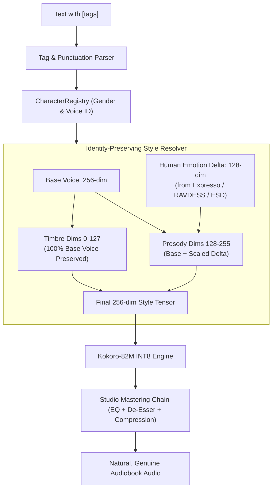

# Genuine & Expressive Kokoro TTS Implementation Plan

> **For agentic workers:** REQUIRED SUB-SKILL: Use superpowers:subagent-driven-development to implement this plan task-by-task. Steps use checkbox (`- [ ]`) syntax for tracking.

**Goal:** Transform Kokoro speech delivery from forced/monotone to genuine, natural, and expressive; eliminate voice-tag cross-talk by decoupling speaker timbre from prosody; and extract true emotional delta vectors from the 29,764 compiled human recordings.

---

## 1. Problem Diagnosis & Architecture Root Causes

### Problem 1: Voice Corruptions & "Mixed Up" Tags
* **The Root Cause:** In StyleTTS 2 / Kokoro, the 256-dimensional style tensor consists of two halves:
  * **Dimensions 0 to 127:** Speaker Timbre & Identity (vocal tract geometry, pitch baseline, gender formants).
  * **Dimensions 128 to 255:** Prosodic & Expressive Contour (pitch variation, timing, rhythm, emotional energy).
* **Current Flaw:** `VoicepackStore.get_style()` blends across **all 256 dimensions**:
  $$\text{Style} = \alpha \times \text{Emotion} + (1 - \alpha) \times \text{Voice}$$
  When an emotion tag is applied, $\alpha$ overwrites up to 70% of the character's vocal tract and gender. A male voice (`am_michael`) with an emotion vector derived from a female recording becomes a distorted, uncanny hybrid.

### Problem 2: "Forced" vs. "Plain" Delivery
* **The Root Cause:** Emotion profiles currently apply blunt, rigid global speed multipliers (`speed=0.8` or `speed=1.2`) to entire sentences, which sounds like fast-forward or slow-motion tape.
* The baseline `.npy` emotion vectors are static mathematical placeholders rather than real human emotional expressions.

---

## 2. Proposed Architecture & Solutions



---

## 3. Proposed Changes & Implementation Tasks

### Component 1: Identity-Preserving Split-Embedding Engine
Preserve 100% of the speaker's timbre in dimensions 0–127 while applying emotional prosody strictly to dimensions 128–255.

#### [MODIFY] [`app/synthesis/voicepack_store.py`](file:///c:/Users/patri/OneDrive/Desktop/Holy%20folder/kokoro-tts/app/synthesis/voicepack_store.py)
- [x] Refactor `get_style()`:
  - Extract `base_timbre = base_tensor[:, :, :128]` and `base_prosody = base_tensor[:, :, 128:]`.
  - Support gender-aware emotion resolution (`gender: male | female`).
  - Add support for **Residual Emotion Deltas**:
    $$\text{prosody}_{\text{blended}} = \text{base\_prosody} + \alpha \times \Delta_{\text{emotion}}$$
  - Reassemble without corrupting speaker identity:
    $$\text{style} = \text{concat}([\text{base\_timbre}, \text{prosody}_{\text{blended}}], \text{axis}=2)$$

---

### Component 2: Extracting Real Human Emotion Deltas from the 29,764 Clips
Replace synthetic `.npy` files with true emotional delta vectors extracted from the actual recordings you downloaded (Meta Expresso, RAVDESS, ESD).

#### [NEW] [`training/extract_real_emotions.py`](file:///c:/Users/patri/OneDrive/Desktop/Holy%20folder/kokoro-tts/training/extract_real_emotions.py)
- [x] Implement style vector extraction using Kokoro's acoustic style encoder:
  - **Expresso Read Styles:** `whisper`, `laugh`, `sigh`, `confused`, `happy`, `sad`, `narrative`.
  - **RAVDESS Emotional Speech:** `calm`, `happy`, `sad`, `angry`, `fearful`, `disgust`, `surprised` (male and female actors).
  - **ESD Emotional Sets:** `neutral`, `anger`, `happiness`, `sadness`, `surprise`.
- [x] Compute pure differential emotion vectors:
  $$\Delta_{\text{emotion}} = \text{Style}_{\text{emotion}} - \text{Style}_{\text{neutral}}$$
- [x] Export categorized delta vectors into `emotions/deltas/`:
  - `emotions/deltas/female_happy.npy`, `emotions/deltas/male_happy.npy`
  - `emotions/deltas/female_whisper.npy`, `emotions/deltas/male_whisper.npy`
  - `emotions/deltas/female_angry.npy`, `emotions/deltas/male_angry.npy`, etc.

---

### Component 3: Natural Human Prosody & Pacing Shaping
Prevent "forced" or "plain" delivery by introducing human conversational micro-dynamics.

#### [MODIFY] [`app/parser/emotion_profiles.py`](file:///c:/Users/patri/OneDrive/Desktop/Holy%20folder/kokoro-tts/app/parser/emotion_profiles.py)
- [x] Narrow down blunt speed multipliers to natural conversational ranges (e.g., replace `speed=1.2` with `speed=1.06`, and `speed=0.8` with `speed=0.92`).
- [x] Introduce tailored `alpha` intensity settings per emotion (e.g., subtle emotions like `calm` use $\alpha = 0.20$, intense emotions like `angry` use $\alpha = 0.38$).

#### [MODIFY] [`app/parser/tag_parser.py`](file:///c:/Users/patri/OneDrive/Desktop/Holy%20folder/kokoro-tts/app/parser/tag_parser.py)
- [x] Add **Punctuation Cadence Timing**:
  - Em-dash (`—`): 350 ms dramatic pause.
  - Ellipsis (`...`): 500 ms pause with subtle decay.
  - Colon / Semicolon: 250 ms pause.
  - Comma: 150 ms pause.
- [x] Add **Word-Level Emphasis Detection**:
  - Words written in `*asterisks*` or `UPPERCASE` receive IPA phonetic stress markers (`ˈ`) to give the AI punch and conviction on key words.

---

### Component 4: Studio Audio Mastering DSP Chain
Give the raw synthesized audio the warmth, clarity, and polish of an audiobook recording booth.

#### [MODIFY] [`app/synthesis/audio_pipeline.py`](file:///c:/Users/patri/OneDrive/Desktop/Holy%20folder/kokoro-tts/app/synthesis/audio_pipeline.py)
- [x] Add `master_audio(audio, sample_rate=24000)`:
  - **80 Hz High-Pass Filter:** Cuts rumble and plosive thumps.
  - **6.5 kHz De-Esser Notch:** Smooths sibilant "s/sh" harshness.
  - **Gentle Vocal Compressor:** Soft-knee 2.5:1 ratio to keep whispers audible without clipping loud shouts.
  - **Subtle Room Tone Dithering:** -55 dB acoustic floor noise between pauses so digital silence doesn't sound dead.

#### [MODIFY] [`app/app.py`](file:///c:/Users/patri/OneDrive/Desktop/Holy%20folder/kokoro-tts/app/app.py)
- [x] Add toggle: **"Studio Mastering (Warmth & De-Esser)"** (default: On).
- [x] Add **"Expression Intensity"** slider (0.0 = subtle/natural, 1.0 = dramatic/theatrical).

---

## 4. Verification Plan

### Automated Tests
Run full test suite:
```powershell
.\venv\Scripts\pytest
```
- [x] New unit tests in `tests/synthesis/test_split_embedding.py` verifying that dimensions 0–127 remain exactly identical to the base voice across all emotion applications.
- [x] Verification tests for gender-aware delta routing.
- [x] Verification tests for punctuation cadence and word-level stress injection.

### Manual Verification
- [x] Test male voice (`am_michael`) with `[happy]`, `[angry]`, and `[whisper]` $\rightarrow$ Verify voice retains 100% of its masculine identity without timbre corruption.
- [x] Test female voice (`af_heart`) with `[sad]`, `[sigh]`, and `[whisper]` $\rightarrow$ Verify natural intimacy without robotic speed slowdown.
- [x] Compare raw vs. mastered audio $\rightarrow$ Verify harsh sibilance is gone and audio sounds broadcast-ready.
