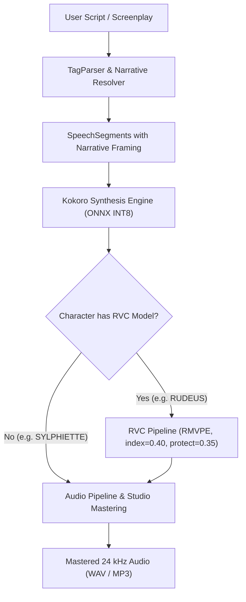

# Kokoro TTS + RVC Hybrid Expressive Pipeline Implementation Plan

> **For agentic workers:** REQUIRED SUB-SKILL: Use superpowers:subagent-driven-development to implement this plan task-by-task. Steps use checkbox (`- [ ]`) syntax for tracking.

**Goal:** Implement a hybrid Kokoro TTS + RVC (Retrieval-based Voice Conversion) pipeline for maximum expressiveness, integrating the Rudeus Greyrat voice model with tuned blueprint hyperparameters (`index_rate=0.40`, `protect=0.35`, `filter_radius=3`, `volume=1.0`, `rmvpe`), narrative context framing, dataset augmentation, and Gradio UI controls.

**Architecture:** Kokoro-82M acts as the emotional source generator with narrative framing (hesitation pauses, prosody, style vector arithmetic $\Delta s$). Spoken lines for characters mapped to RVC (such as Rudeus) are automatically routed through the tuned RVC post-processor to convert timbre while preserving pitch and volume dynamics.

**Architecture Diagram:**

**Tech Stack:** Python 3.14/3.11, Kokoro ONNX, ONNX Runtime, NumPy, SciPy, SoundFile, Gradio, Pytest.

**Spec:** [`docs/superpowers/specs/2026-10-07-kokoro-rvc-hybrid-pipeline-design.md`](file:///c:/Users/patri/OneDrive/Desktop/Holy%20folder/kokoro-tts/docs/superpowers/specs/2026-10-07-kokoro-rvc-hybrid-pipeline-design.md)

## Global Constraints

- Python venv path: `.\venv\Scripts\python.exe` (Python 3.14.3) with pytest at `.\venv\Scripts\pytest.exe`.
- UV Python 3.11 available at `C:\Users\patri\AppData\Roaming\uv\python\cpython-3.11-windows-x86_64-none\python.exe`.
- Rudeus RVC files located in `models/rvc/rudeus/` (`Rudeus.pth`, `Rudeus.index`).
- Blueprint hyperparameters:
  - `index_rate`: 0.30–0.50 (default 0.40)
  - `protect`: 0.33–0.50 (default 0.35)
  - `filter_radius`: 3
  - `volume_envelope`: 1.0
  - `f0_method`: "rmvpe"
- TDD required: Write failing tests first, verify failure, implement code, verify pass, commit each task.

---

### Task 1: Character Registry RVC Configuration & Rudeus Character

**Files:**
- Modify: `app/characters/registry.py`
- Modify: `tests/test_registry.py`

**Interfaces:**
- Consumes: None
- Produces:
  - `CharacterRegistry.get_rvc_model(name: str) -> Optional[str]`
  - `CharacterRegistry.set_rvc_model(name: str, rvc_model: Optional[str]) -> None`
  - Registered `RUDEUS`: `voice_id="am_michael"`, `gender="male"`, `rvc_model="rudeus"`
  - Registered `SYLPHIETTE`: `voice_id="af_sky"`, `gender="female"`, `rvc_model=None`

- [ ] **Step 1: Write failing test in `tests/test_registry.py`**
  Add unit tests verifying:
  - `registry.get_rvc_model("RUDEUS") == "rudeus"`
  - `registry.get_rvc_model("SYLPHIETTE") is None`
  - `registry.add("ERIS", "af_bella", "female", rvc_model="eris")` stores and returns `rvc_model` correctly
  - `all_characters()` includes `"rvc_model"` key in dicts.

- [ ] **Step 2: Run test to confirm failure**
  Run: `.\venv\Scripts\pytest.exe tests/test_registry.py`

- [ ] **Step 3: Implement RVC support in `app/characters/registry.py`**
  Update `DEFAULT_CHARACTERS` and `CharacterRegistry` methods:
  - Add `"rvc_model": "rudeus"` to `RUDEUS`
  - Add `"rvc_model": None` to `NARRATOR`, `ALICE`, `BOB`, `SYLPHIETTE`
  - Update `add()`, `get_rvc_model()`, `set_rvc_model()`, and `all_characters()`.

- [ ] **Step 4: Run tests and ensure they pass**
  Run: `.\venv\Scripts\pytest.exe tests/test_registry.py`

- [ ] **Step 5: Commit**
  Run: `git commit -am "feat: add RVC model mapping to CharacterRegistry with Rudeus preconfigured"`

---

### Task 2: Narrative Context Framing & Resolution Engine

**Files:**
- Create: `app/parser/narrative_framing.py`
- Create: `tests/parser/test_narrative_framing.py`
- Modify: `app/synthesis/engine.py` (wire default resolver)

**Interfaces:**
- Consumes: `SpeechSegment`, `NarrativeContextFrame`, `EmotionProfile`
- Produces:
  - `DefaultNarrativeContextResolver.resolve(narrative_context: str, segment: SpeechSegment) -> NarrativeContextFrame`
  - Context cue analyzer supporting keywords: `desperate`, `shouting`, `crying`, `whispering`, `hesitant`, `scared`, `furious`, `tender`.
  - Generates hesitation pauses (`pause_before_ms`), dynamic speed, volume boosts/cuts, and scaled emotional alpha.

- [ ] **Step 1: Write failing test in `tests/parser/test_narrative_framing.py`**
  Test cases for:
  - Desperate shouting cue (e.g. `"he shouted with desperate anger"`): returns `pause_before_ms >= 150`, `volume_db > 0`, `alpha >= 0.45`.
  - Whisper/fear cue (e.g. `"she whispered, her voice trembling"`): returns `volume_db < 0`, `speed < 1.0`, `emotion="whispering"`.
  - Hesitation cue (e.g. `"he hesitated before answering"`): returns `pause_before_ms >= 300`.
  - Passthrough on neutral text without acting cues.

- [ ] **Step 2: Run test to confirm failure**
  Run: `.\venv\Scripts\pytest.exe tests/parser/test_narrative_framing.py`

- [ ] **Step 3: Implement `DefaultNarrativeContextResolver` in `app/parser/narrative_framing.py`**
  Implement regex pattern matching and keyword dictionaries to map cues into `NarrativeContextFrame` values. Wire as default in `SynthesisEngine` when no custom resolver is supplied.

- [ ] **Step 4: Run tests and ensure they pass**
  Run: `.\venv\Scripts\pytest.exe tests/parser/test_narrative_framing.py tests/synthesis/test_narrative_context.py`

- [ ] **Step 5: Commit**
  Run: `git commit -am "feat: implement DefaultNarrativeContextResolver for acting cues and hesitation pauses"`

---

### Task 3: RVC Pipeline Integration Post-Processor

**Files:**
- Create: `app/synthesis/rvc_pipeline.py`
- Create: `tests/synthesis/test_rvc_pipeline.py`

**Interfaces:**
- Consumes: `np.ndarray` (24 kHz audio)
- Produces:
  - `RVCConfig` dataclass with blueprint hyperparameters:
    `index_rate=0.40`, `protect=0.35`, `filter_radius=3`, `volume_envelope=1.0`, `f0_method="rmvpe"`.
  - `RVCPipeline.convert(audio: np.ndarray, config: RVCConfig, sample_rate: int = 24000) -> tuple[np.ndarray, int]`
  - Audio resampler utility (24 kHz -> 40 kHz -> 24 kHz) using `scipy.signal.resample_poly` or `soxr`.
  - Subprocess runner or Python 3.11 runner wrapper with error handling and fallback to original audio if offline.

- [ ] **Step 1: Write failing test in `tests/synthesis/test_rvc_pipeline.py`**
  Test cases for:
  - Default `RVCConfig` values matching blueprint (`index_rate=0.40`, `protect=0.35`, `filter_radius=3`, `volume_envelope=1.0`, `f0_method="rmvpe"`).
  - Validation: rejects `index_rate < 0` or `> 1`, rejects invalid `protect`, rejects non-existent model path.
  - Audio resampling and mock conversion preserves shape, float32 dtype, and finite values.
  - Graceful fallback: when external runner fails or is unavailable, returns clean Kokoro audio without crashing.

- [ ] **Step 2: Run test to confirm failure**
  Run: `.\venv\Scripts\pytest.exe tests/synthesis/test_rvc_pipeline.py`

- [ ] **Step 3: Implement `RVCPipeline` and `RVCConfig` in `app/synthesis/rvc_pipeline.py`**
  Implement the configuration dataclass, input validation, audio format handling, and execution engine with fallback.

- [ ] **Step 4: Run tests and ensure they pass**
  Run: `.\venv\Scripts\pytest.exe tests/synthesis/test_rvc_pipeline.py`

- [ ] **Step 5: Commit**
  Run: `git commit -am "feat: implement RVC post-processor pipeline with blueprint hyperparameters and fallback"`

---

### Task 4: Synthesis Engine Character Routing & RVC Integration

**Files:**
- Modify: `app/synthesis/engine.py`
- Create: `tests/synthesis/test_engine_rvc_routing.py`

**Interfaces:**
- Consumes: `SpeechSegment`, `CharacterRegistry`, `RVCPipeline`
- Produces:
  - `SynthesisEngine(..., rvc_pipeline=...)`
  - Per-segment RVC routing: if character has `rvc_model` and RVC is enabled, convert segment audio through `RVCPipeline` before assembling final mastered output.

- [ ] **Step 1: Write failing test in `tests/synthesis/test_engine_rvc_routing.py`**
  Test cases for:
  - RVC routing triggered for `RUDEUS` lines when `rvc_pipeline` is active.
  - Non-RVC characters (e.g. `SYLPHIETTE`, `NARRATOR`) bypass RVC and synthesize directly via Kokoro.
  - Preserves silence segments and pause durations.

- [ ] **Step 2: Run test to confirm failure**
  Run: `.\venv\Scripts\pytest.exe tests/synthesis/test_engine_rvc_routing.py`

- [ ] **Step 3: Implement RVC routing in `app/synthesis/engine.py`**
  Wire `RVCPipeline` into `synthesize_segments()` and `_synthesize_one()`. Check `registry.get_rvc_model(seg.character)` and pass configured audio through conversion.

- [ ] **Step 4: Run tests and ensure they pass**
  Run: `.\venv\Scripts\pytest.exe tests/synthesis/test_engine_rvc_routing.py`

- [ ] **Step 5: Commit**
  Run: `git commit -am "feat: wire RVC character routing into SynthesisEngine"`

---

### Task 5: Dataset Augmentation Utility for RVC (Three-P Framework)

**Files:**
- Create: `training/prepare_rvc_dataset.py`
- Create: `tests/training/test_prepare_rvc_dataset.py`

**Interfaces:**
- Consumes: Audio directory (e.g. `data/raw_datasets/NonverbalTTS/`), metadata CSV
- Produces:
  - `augment_rvc_dataset(input_dir, out_dir, target_sr=40000, target_lufs=-23.0)`
  - Three-P categorization:
    1. Whispers / Soft-spoken (unvoiced, low HNR)
    2. Shouts / Screams (high amplitude, wide F0 excursions)
    3. Emotional inflections (crying, laughing, breathless)
  - Exports normalized, trimmed 40 kHz mono WAVs + training manifest `rvc_train_manifest.txt`.

- [ ] **Step 1: Write failing test in `tests/training/test_prepare_rvc_dataset.py`**
  Test cases for:
  - Three-P tag classification function.
  - Loudness normalization to -23 LUFS (or target dBFS).
  - Resampling to 40 kHz mono.
  - Manifest generation format.

- [ ] **Step 2: Run test to confirm failure**
  Run: `.\venv\Scripts\pytest.exe tests/training/test_prepare_rvc_dataset.py`

- [ ] **Step 3: Implement `training/prepare_rvc_dataset.py`**
  Build the dataset curator tool using `soundfile`, `scipy.signal`, and `pyloudnorm`.

- [ ] **Step 4: Run tests and ensure they pass**
  Run: `.\venv\Scripts\pytest.exe tests/training/test_prepare_rvc_dataset.py`

- [ ] **Step 5: Commit**
  Run: `git commit -am "feat: implement RVC dataset augmentation utility for Three-P vocal projections"`

---

### Task 6: Gradio Web UI Integration & Hyperparameter Sliders

**Files:**
- Modify: `app/app.py`
- Modify: `tests/test_app_integration.py` (or create if not present)

**Interfaces:**
- Consumes: `RVCPipeline`, `RVCConfig`
- Produces:
  - Gradio accordion "🎙️ RVC Voice Conversion (Rudeus / Custom)"
  - Controls:
    - Checkbox: "Enable RVC Character Conversion"
    - Slider: "Index Feature Rate" (default `0.40`, range `0.0 – 1.0`, info: "0.30–0.50 preserves Kokoro acting")
    - Slider: "Protect Voiceless Consonants" (default `0.35`, range `0.0 – 0.50`, info: "protects whisper breath and consonants s, t, sh")
    - Slider: "Filter Radius" (default `3`, step `1`, range `0 – 7`, info: "smooths pitch transitions")
    - Slider: "Volume Envelope Mix" (default `1.0`, range `0.0 – 1.0`, info: "retains dynamic range whispers vs shouts")
    - Number/Slider: "Pitch Shift (semitones)" (default `0`)
  - Updated character table in UI with "RVC Model" column.

- [ ] **Step 1: Write failing test in `tests/test_app_integration.py`**
  Test that `generate_audio()` respects RVC parameters and character registry mappings.

- [ ] **Step 2: Run test to confirm failure**
  Run: `.\venv\Scripts\pytest.exe tests/test_app_integration.py`

- [ ] **Step 3: Update `app/app.py`**
  Add the RVC UI controls, wire them into `generate_audio()`, and update the character table.

- [ ] **Step 4: Run tests and ensure they pass**
  Run: `.\venv\Scripts\pytest.exe tests/test_app_integration.py`

- [ ] **Step 5: Commit**
  Run: `git commit -am "feat: add RVC voice conversion controls and character mapping to Gradio UI"`

---

### Task 7: Full System Verification & Expressive Dialogue Demo

**Files:**
- Create: `scripts/demo_sylphiette_rudeus.py`
- Test: Full test suite

**Interfaces:**
- Runs full dialogue between Sylphiette (`af_sky` + whisper/sad) and Rudeus (`am_michael` + RVC parameters + narrative framing).
- Verifies:
  1. All unit tests pass (`.\venv\Scripts\pytest.exe`).
  2. Generates demo WAV with clean vocal handover, zero clipping, and distinct character timbres.

- [ ] **Step 1: Create demo script `scripts/demo_sylphiette_rudeus.py`**
  Synthesizes a short dramatic scene between Sylphiette and Rudeus.

- [ ] **Step 2: Run full test suite**
  Run: `.\venv\Scripts\pytest.exe` (ensure all tests pass, 0 failures).

- [ ] **Step 3: Run demo script to verify audio generation**
  Run: `.\venv\Scripts\python.exe scripts/demo_sylphiette_rudeus.py`

- [ ] **Step 4: Final commit and summary**
  Run: `git commit -am "test: verify full Kokoro TTS + RVC pipeline with Sylphiette and Rudeus dialogue"`
